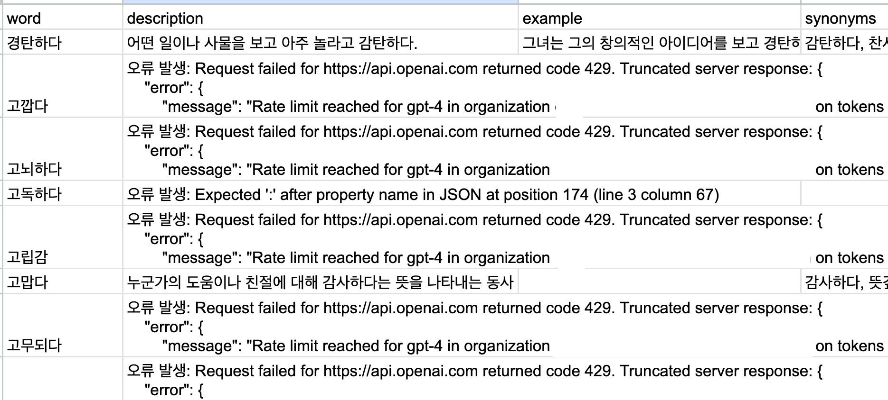
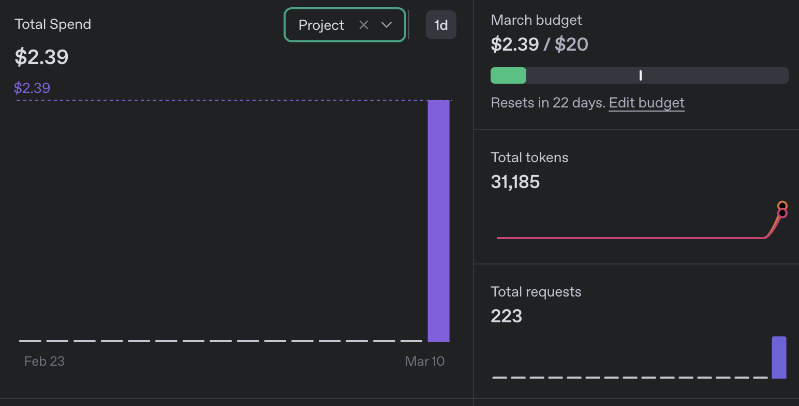

# MindLift 감정 단어 데이터 제작 이야기

400여개의 한글 감정 단어가 있다.
각각 한 단어 당 설명, 예문, 유사어를 작성해야함.

OpenAI API Key도 사용할 수 있으니 스프레드 시트의 GAS(Google Apps Script)로 만들어서 해 봐야지!

ChatGPT에게 예상 비용을 물어봄.
모델은 GPT-4, 입력 토큰은 고정, 출력 토큰은 가변적. 답변 내용은 아래와 같다.
```
즉, 감정 단어 1개를 요청하면:

- 입력 비용: 감정 단어 1개의 입력 토큰 비용
- 출력 비용: 해당 단어의 설명 + 예문 + 유사어를 생성하는 데 사용되는 토큰 비용

- 입력 토큰 비용: 약 $0.00004 (4센트 / 10,000단어)
- 출력 토큰 비용: 약 $0.00207 (2.07달러 / 1,000단어)

만약 하루에 1,000개의 감정 단어를 API를 통해 요청한다면,
1,000 × $0.0021 = 약 $2.11 이 하루 비용이 됩니다.
```

오, 나는 400여개의 단어밖에 안되니 충분히 해볼만한 가격인걸?
따라서, 실행에 옮김!

하지만...



엑셀에서 챠라락 하듯이 셀 적용했더니

```
 Request failed for https://api.openai.com returned code 429. Truncated server response: {
    ""error"": {
        ""message"": ""Rate limit reached for gpt-4 in organization [organization name] on tokens per min (TPM): Limit 10000... (use muteHttpExceptions option to examine full response)
```

오 그래? 그럼 조금씩 긁어서(무슨 뜻인지 아시죠?) 호출하겠어!하고
2~5개 씩 긁기를 3번 하고 요금을 확인해보니...



총 호출 수가 223인데 벌써 2.39달러?!?!?!?!?!?
분명 `만약 하루에 1,000개의 감정 단어를 API를 통해 요청한다면,
1,000 × $0.0021 = 약 $2.11 이 하루 비용이 됩니다.` 이라고 했잖아요!

(어떤 착오가 있었던 것 같다)

(직접 호출이라 그랬나? 이 부분은 더 알아보기로.)

당장 버리고 무료의 방법을 찾기로 하다.