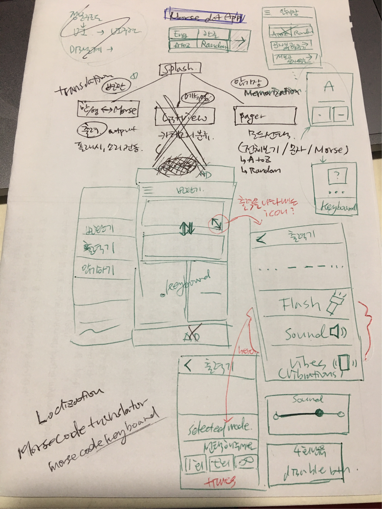
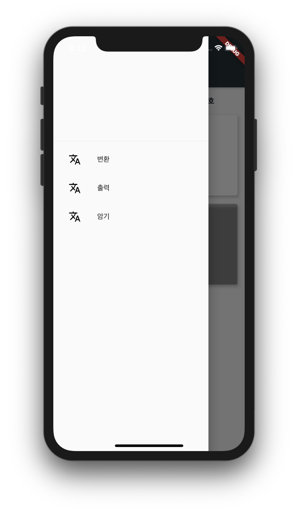
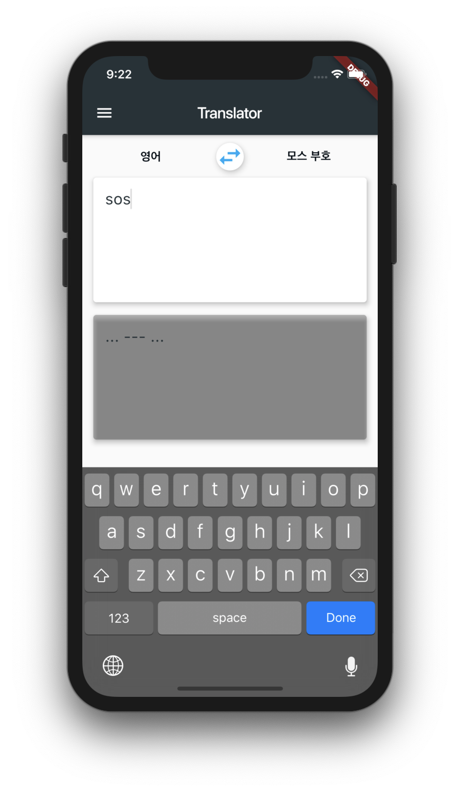

# morseDotApp 개발 일지 #001

[Flutter](https://flutter.dev/)를 이용해 서버 네트워크가 필요 없는 모스 부호 변환 기능의 모바일 어플리케이션 개발을 시작합니다.

morseDotApp은 가제입니다. 앱 이름에 대한 아이디어가 있으시다면 추천해주셔도 좋습니다!

## MVP (Minimum Viable Product)

> 예를 들어, 카메라 어플리케이션의 경우, 사진찍기/사진 저장이 MVP라고 할 수 있습니다. 
> MVP를 설정하면 아이디어가 검증 될 수 있는지 빠르게 검증해 볼 수 있습니다.

- 변환 기능
  - 버튼 두 개(Dot, Dash)의 모스 코드 키보드로 입력 받은 모스 부호를 한글 혹은 로마자로 변환하기
  - 한글 혹은 영어를 모스 부호로 변환하기

### 추가적인 기능

- 출력 기능
  - 모스 부호를 플래시로 출력
  - 소리로 출력
  - 진동으로 출력
- 암기장 기능
  - 3가지 모드의 모스 부호 암기장
    - 전체 보기 (A to Z, Random)
    - 문자를 보고 모스 부호 입력하기
    - 모스 부호를 보고 문자 입력하기

### 고려해야 할 사항

- 출력 기능 - 실기기로 테스트 해야 할 가능성이 높음
- 암기장 기능 - 어떤 UI로 접근해야하는지 리서치 필요

## UI 스케치

1. 머리속에 떠다니는 구상을 정보 구조도(검은색 내용)로 간단하게 정리했습니다.

2. 정보 구조도를 토대로 UI(초록색 내용)를 표현합니다.

3. 추가적인 정보는 빨간색 내용으로 메모했습니다.

## 프로젝트 생성과 기본 작업

- 새 프로젝트 생성 후 파일들을 정리하고, 빈 화면이지만 페이지 파일을 만들어 뼈대를 잡습니다.

- 위젯 추출이나 상수 파일, 중복되는 스타일(폰트, 컬러 등)과 같은 간단한 리팩토링은 바로바로 진행합니다.

- 미완성 된 기능에 대해서는 추가 작업 후 리팩토링을 할 수 있게 todo 주석으로 표시 해놓습니다.

